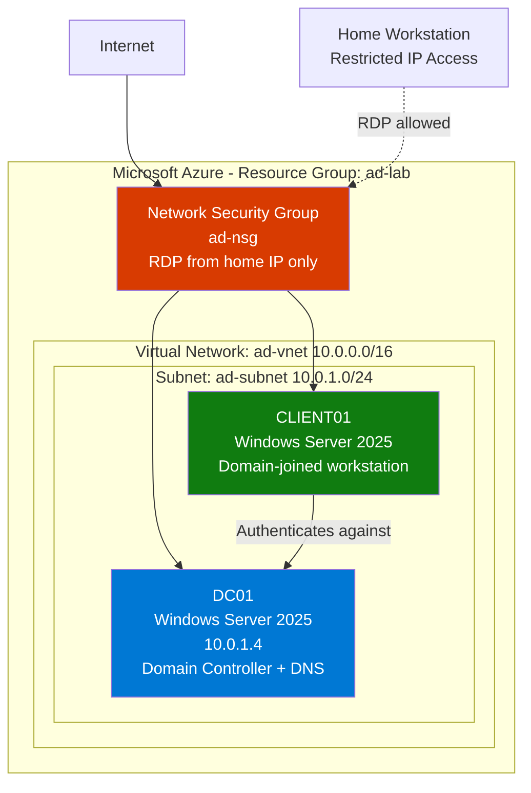

# corp-lab-active-directory
Active Directory home lab built on Microsoft Azure for IT practice

# Corp Lab — Active Directory Home Lab

A complete Active Directory environment built on Microsoft Azure to practice 
IT support specialist workflows. Includes domain controller deployment, 
organizational structure, file services with role-based access control, 
group policy, domain-joined workstation, and ticket-based incident response.

## Project Overview

This lab simulates a small healthcare-style IT environment with multiple 
departments, role-based access control, and a working ticketing system. 
Built from scratch on Azure to demonstrate hands-on capability for IT 
support roles.

## Architecture



## Environment Specifications

| Component | Specification |
|-----------|---------------|
| Cloud Provider | Microsoft Azure (Azure for Students) |
| Region | East US |
| Domain | corp.local |
| Forest Functional Level | Windows Server 2025 |
| Domain Controller | Windows Server 2025 Datacenter (Standard_B2ms) |
| Workstation | Windows Server 2025 Datacenter (Standard_B2s) |
| Network Segmentation | Single VNet, single subnet, NSG-enforced firewall |
| Ticketing System | Spiceworks Cloud Help Desk |

## Skills Demonstrated

- **Active Directory:** Forest/domain creation, OU design, user and group management
- **PowerShell automation:** Bulk user creation, permission auditing, scripted operations
- **File services:** SMB share creation, NTFS permission inheritance, RBAC implementation
- **Group Policy:** GPO authoring, deployment, and verification
- **Network security:** NSG rule configuration, least-privilege access patterns
- **Domain operations:** Workstation join, DNS configuration, troubleshooting
- **Azure administration:** Resource groups, VNets, VMs, cost management
- **IT support workflow:** Ticket triage, escalation procedures, identity verification practices

## Repository Structure

```
corp-lab-active-directory/
├── README.md                          ← You are here
├── docs/
│   ├── 01-azure-infrastructure.md     ← Resource group, VNet, NSG setup
│   ├── 02-domain-controller.md        ← DC01 deployment and promotion
│   ├── 03-organizational-structure.md ← OUs, users, security groups
│   ├── 04-file-services.md            ← Shares, NTFS, share permissions
│   ├── 05-group-policy.md             ← Logon banner GPO
│   ├── 06-client-workstation.md       ← CLIENT01 deploy + domain join
│   ├── 07-access-testing.md           ← End-to-end RBAC validation
│   ├── 08-ticket-workflow.md          ← Spiceworks setup and scenarios
│   └── 09-lessons-learned.md          ← Reflections and gotchas
├── scripts/
│   ├── create-users.ps1               ← Bulk user creation
│   ├── audit-permissions.ps1          ← NTFS permission audit
│   └── reset-lab-passwords.ps1        ← Password reset utility
└── screenshots/                       ← Visual evidence (TBD)
```

## Quick Stats

- **9** user accounts created
- **5** organizational units
- **5** security groups with role-based memberships
- **4** file shares with NTFS + share permission layering
- **1** custom Group Policy Object enforcing logon banner
- **7** documented support ticket scenarios

## Status

🚧 Lab is operational. Documentation is being expanded with detailed 
walkthroughs and reflections.

## About

Built as part of preparation for an IT Support Specialist role. Designed 
to demonstrate not just technical knowledge but also workflow discipline — 
identity verification before password resets, proper escalation procedures, 
least-privilege permission models, and clean documentation.

---

*Lab built on Microsoft Azure using Azure for Students subscription.*
