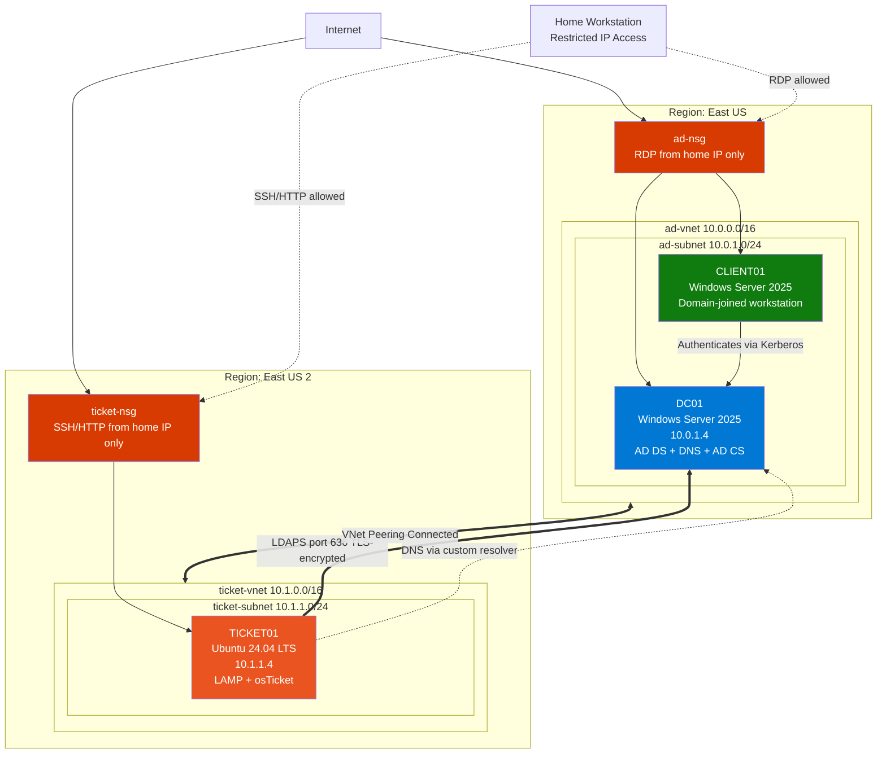

# corp-lab-active-directory
Active Directory home lab built on Microsoft Azure for IT practice

# Corp Lab — Active Directory Home Lab

A complete Active Directory environment built on Microsoft Azure to practice 
IT support specialist workflows. Includes domain controller deployment, 
organizational structure, file services with role-based access control, 
group policy, domain-joined workstation, and ticket-based incident response.

## Project Overview

This lab simulates a small healthcare-style IT environment with multiple 
departments, role-based access control, and a working ticketing system. 
Built from scratch on Azure to demonstrate hands-on capability for IT 
support roles.

## Architecture



## Environment Specifications

| Component | Specification |
|-----------|---------------|
| Cloud Provider | Microsoft Azure (Azure for Students) |
| Region | East US |
| Domain | corp.local |
| Forest Functional Level | Windows Server 2025 |
| Domain Controller | Windows Server 2025 Datacenter (Standard_B2ms) |
| Workstation | Windows Server 2025 Datacenter (Standard_B2s) |
| Network Segmentation | Single VNet, single subnet, NSG-enforced firewall |
| Ticketing System | osTicket 1.18.2 (self-hosted) |
| Helpdesk VM | Ubuntu Server 24.04 LTS (Standard_B1s) in East US 2 |
| Helpdesk VNet | ticket-vnet (10.1.0.0/16), single subnet 10.1.1.0/24 |
| Cross-region connectivity | VNet peering (ad-vnet ↔ ticket-vnet) |
| LAMP stack | Apache 2.4, MariaDB 10.x, PHP 8.3 |
| Certificate Authority | Enterprise Root CA on DC01 (corp-DC01-CA, 5-year validity) |
| Authentication | LDAPS (port 636) with auto-enrolled DC certificate |

## Skills Demonstrated

- **Active Directory:** Forest/domain creation, OU design, user and group management
- **PowerShell automation:** Bulk user creation, permission auditing, scripted operations
- **File services:** SMB share creation, NTFS permission inheritance, RBAC implementation
- **Group Policy:** GPO authoring, deployment, and verification
- **Network security:** NSG rule configuration, least-privilege access patterns
- **Domain operations:** Workstation join, DNS configuration, troubleshooting
- **Azure administration:** Resource groups, VNets, VMs, cost management
- **IT support workflow:** Ticket triage, escalation procedures, identity verification practices
- **Multi-region Azure architecture:** VNet peering, cross-region DNS resolution, region-aware quota management, subnet-scoped NSG design
- **Linux server administration:** Ubuntu Server 24.04, LAMP stack deployment, SSH key auth, systemd service management, Apache vhost configuration, MariaDB hardening
- **DNS troubleshooting on Linux:** systemd-resolved drop-in configuration, mDNS/LLMNR/.local conflict resolution, SRV record validation
- **PKI deployment:** AD Certificate Services as Enterprise Root CA, certificate auto-enrollment, LDAPS configuration on domain controllers
- **Identity federation:** LDAPS bind from Linux/PHP to AD, simple bind authentication, AD attribute retrieval, cross-OS authentication design
- **Systematic troubleshooting:** Layer-by-layer diagnosis (network → DNS → protocol → application), use of `dig` / `nslookup` / `nc` / `ldapsearch` to isolate failure points


## Repository Structure

```
corp-lab-active-directory/
├── README.md                          ← You are here
├── docs/
│   ├── 01-azure-infrastructure.md     ← Resource group, VNet, NSG setup
│   ├── 02-domain-controller.md        ← DC01 deployment and promotion
│   ├── 03-organizational-structure.md ← OUs, users, security groups
│   ├── 04-file-services.md            ← Shares, NTFS, share permissions
│   ├── 05-group-policy.md             ← Logon banner GPO
│   ├── 06-client-workstation.md       ← CLIENT01 deploy + domain join
│   ├── 07-access-testing.md           ← End-to-end RBAC validation
│   ├── 08-ticket-workflow.md          ← Ticket workflow + osTicket choice
│   ├── 09-lessons-learned.md          ← Reflections and gotchas
│   ├── 10-osticket-deployment.md      ← LAMP + osTicket build
│   └── 11-cross-region-ad-integration.md  ← VNet peering, DNS, AD CS, LDAPS
├── scripts/
│   ├── create-users.ps1               ← Bulk user creation
│   ├── audit-permissions.ps1          ← NTFS permission audit
│   ├── reset-lab-passwords.ps1        ← Password reset utility
│   ├── dc01-firewall-rules.ps1        ← AD port allowances for ticket-vnet
│   └── ticket01-no-mdns.conf          ← systemd-resolved drop-in
└── screenshots/                       ← Visual evidence (TBD)
```

## Quick Stats

- **9** user accounts created
- **5** organizational units
- **5** security groups with role-based memberships
- **4** file shares with NTFS + share permission layering
- **1** custom Group Policy Object enforcing logon banner
- **7** documented support ticket scenarios
## Cross-Region Helpdesk Integration

The lab includes a fully separate helpdesk deployment in East US 2 running 
osTicket on Ubuntu Server 24.04. Cross-region operation was initially a 
workaround for vCPU quota constraints in East US; it became a deliberate 
architectural choice that adds VNet peering, cross-region DNS, and PKI 
deployment to the demonstrated skill set.

Authentication flows from osTicket through encrypted LDAPS (port 636) back 
to DC01, allowing AD users to access the helpdesk with their domain 
credentials. The Domain Controller hosts an Enterprise Root CA (AD 
Certificate Services) that auto-enrolled the LDAPS certificate.

See `docs/10-osticket-deployment.md` for the helpdesk build, and 
`docs/11-cross-region-ad-integration.md` for the full integration path 
(peering, DNS, firewall, PKI, plugin configuration).

## Known Limitations

- **osTicket auth-ldap plugin v0.6.2** has documented PHP 8.x compatibility 
  issues in the bundled Net_LDAP2 PEAR library. LDAP authentication 
  partially works (user attributes retrieved from AD), but the full 
  authentication flow is inconsistent. Production migration path is OAuth2 
  via Microsoft Entra ID using osTicket's actively maintained OAuth2 plugin.
- **`.local` TLD** is used as the AD domain (corp.local) to match legacy 
  small-business AD conventions. Modern deployments should use a real 
  internet TLD (e.g., corp.example.com) to avoid Linux mDNS conflicts. 
  The lab includes a systemd-resolved drop-in config to work around this.
- **LDAPS uses a self-signed CA certificate** trusted only within the 
  domain. Linux clients require `TLS_REQCERT never` for the lab; production 
  deployment would distribute the CA cert to client trust stores.

## Status

Lab is operational. Documentation is being expanded with detailed 
walkthroughs and reflections.

## About

This was designed as a part of a passion project to demonstrate not 
just technical knowledge but also workflow discipline — 
identity verification before password resets, proper escalation procedures, 
least-privilege permission models, and clean documentation.

---

*Lab built on Microsoft Azure using Azure for Students subscription.*
