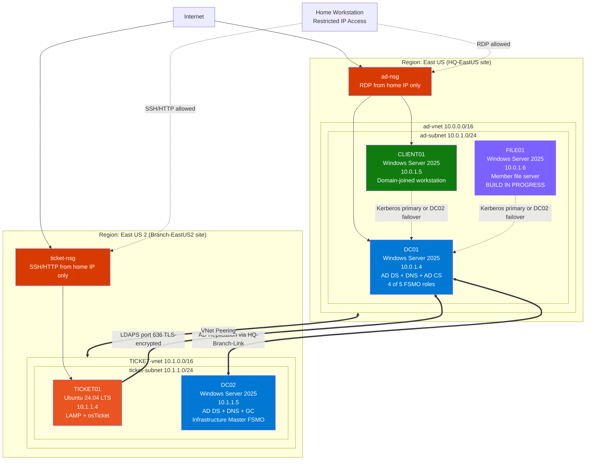

# corp-lab-active-directory
Active Directory home lab built on Microsoft Azure for IT practice

# Corp Lab — Active Directory Home Lab

A complete Active Directory environment built on Microsoft Azure to practice 
IT support specialist workflows. Includes domain controller deployment, 
organizational structure, file services with role-based access control, 
group policy, domain-joined workstation, and ticket-based incident response.

## Project Overview

This lab simulates a small healthcare-style IT environment with multiple 
departments, role-based access control, and a working ticketing system. 
Built from scratch on Azure to demonstrate hands-on capability for IT 
support roles.

## Architecture



## Environment Specifications

| Component | Specification |
| --- | --- |
| Cloud Provider | Microsoft Azure (Azure for Students) |
| Regions | East US (HQ) + East US 2 (Branch) |
| Domain | corp.local |
| Forest Functional Level | Windows Server 2025 |
| AD Sites | HQ-EastUS (10.0.0.0/16), Branch-EastUS2 (10.1.0.0/16) |
| Site Link | HQ-Branch-Link, cost 100, replication interval 15 min |
| Domain Controller 1 (HQ) | DC01, Windows Server 2025 Datacenter (Standard_B2ms), 4 of 5 FSMO roles |
| Domain Controller 2 (Branch) | DC02, Windows Server 2025 Datacenter (Standard_B2s), Infrastructure Master FSMO |
| Workstation | CLIENT01, Windows Server 2025 Datacenter (Standard_B2s) |
| File Server | FILE01, Windows Server 2025 Datacenter (Standard_B2als_v2) — in progress |
| Network Segmentation | Two VNets across regions, NSG-enforced firewall, peering between regions |
| Ticketing System | osTicket 1.18.2 (self-hosted) |
| Helpdesk VM | Ubuntu Server 24.04 LTS (Standard_B1s) in East US 2 |
| Cross-region connectivity | VNet peering (ad-vnet ↔ TICKET-vnet) |
| LAMP stack | Apache 2.4, MariaDB 10.x, PHP 8.3 |
| Certificate Authority | Enterprise Root CA on DC01 (corp-DC01-CA, 5-year validity) |
| Authentication | LDAPS (port 636) with auto-enrolled DC certificate |
| Client DNS configuration | All domain members point to both DCs (10.0.1.4, 10.1.1.5) for HA |

## Skills Demonstrated

- **Active Directory & identity management:** Forest and domain design (corp.local, Windows 2025 functional level); OU hierarchy; user/group lifecycle and bulk operations via PowerShell; multi-DC topology across Azure regions; FSMO role distribution; AD Sites & Services with subnet-to-site mapping and inter-site replication tuning; `repadmin` for replication management and direction control; demonstrated DC failover with HA-aware client DNS

- **Azure cloud infrastructure:** Resource groups, VNets, subnets, NSGs with least-privilege rules; VM deployment across regions; cross-region VNet peering; VM family quota navigation (working around BS Family vCPU cap via Basv2 SKUs); cost-conscious sizing, auto-shutdown discipline, and understanding the difference between Stopped and Stopped (deallocated)

- **Windows Server services:** File services with SMB shares, NTFS permission inheritance, and RBAC tied to AD security groups; Group Policy authoring, deployment, and verification; domain join workflows; DNS configuration and troubleshooting; PowerShell automation for repetitive tasks

- **Linux server administration:** Ubuntu Server 24.04 LTS; LAMP stack (Apache 2.4, MariaDB 10.x, PHP 8.3); systemd service management; SSH key authentication; Apache vhost configuration; MariaDB hardening; systemd-resolved drop-in configuration for mDNS/LLMNR/`.local` conflict resolution

- **PKI and cross-OS identity federation:** AD Certificate Services deployed as Enterprise Root CA; certificate auto-enrollment for DC certificates; LDAPS (port 636) for encrypted directory binds; LDAP bind from Linux/PHP into Active Directory for authentication and attribute retrieval

- **Systematic troubleshooting & IT support workflow:** Layer-by-layer diagnosis (network → DNS → protocol → application) using `dig`, `nslookup`, `nc`, `ldapsearch`, `repadmin`, `dcdiag`, `nltest`; ticket triage and escalation procedures; identity verification before privileged operations (password resets, etc.); documentation discipline producing portfolio-grade build artifacts

## Repository Structure

```
corp-lab-active-directory/
├── README.md                                       ← You are here
├── docs/
│   ├── 01-azure-infrastructure.md                  ← Resource group, VNet, NSG setup
│   ├── 02-domain-controller.md                     ← DC01 deployment and promotion
│   ├── 03-organizational-structure.md              ← OUs, users, security groups
│   ├── 04-file-services.md                         ← Shares, NTFS, share permissions
│   ├── 05-group-policy.md                          ← Logon banner GPO
│   ├── 06-client-workstation.md                    ← CLIENT01 deploy + domain join
│   ├── 07-access-testing.md                        ← End-to-end RBAC validation
│   ├── 08-ticket-workflow.md                       ← Ticket workflow + osTicket choice
│   ├── 09-lessons-learned.md                       ← Reflections and gotchas
│   ├── 10-osticket-deployment.md                   ← LAMP + osTicket build
│   ├── 11-cross-region-ad-integration.md           ← VNet peering, DNS, AD CS, LDAPS
│   ├── 12-dc02-promotion-sites-failover.md         ← Second DC, sites topology, FSMO, failover
│   └── 13-file01-build.md                          ← Member file server build (in progress)
├── scripts/
│   ├── create-users.ps1                            ← Bulk user creation
│   ├── audit-permissions.ps1                       ← NTFS permission audit
│   ├── reset-lab-passwords.ps1                     ← Password reset utility
│   ├── dc01-firewall-rules.ps1                     ← AD port allowances for ticket-vnet
│   └── ticket01-no-mdns.conf                       ← systemd-resolved drop-in
├── session-notes/
└── screenshots/                                    ← Visual evidence (TBD)
```

## Quick Stats

- **9** user accounts created
- **5** organizational units
- **5** security groups with role-based memberships
- **4** file shares with NTFS + share permission layering
- **1** custom Group Policy Object enforcing logon banner
- **7** documented support ticket scenarios
## Cross-Region Helpdesk Integration

The lab includes a fully separate helpdesk deployment in East US 2 running 
osTicket on Ubuntu Server 24.04. Cross-region operation was initially a 
workaround for vCPU quota constraints in East US; it became a deliberate 
architectural choice that adds VNet peering, cross-region DNS, and PKI 
deployment to the demonstrated skill set.

Authentication flows from osTicket through encrypted LDAPS (port 636) back 
to DC01, allowing AD users to access the helpdesk with their domain 
credentials. The Domain Controller hosts an Enterprise Root CA (AD 
Certificate Services) that auto-enrolled the LDAPS certificate.

See `docs/10-osticket-deployment.md` for the helpdesk build, and 
`docs/11-cross-region-ad-integration.md` for the full integration path 
(peering, DNS, firewall, PKI, plugin configuration).

## Known Limitations

- **osTicket auth-ldap plugin v0.6.2** has documented PHP 8.x compatibility 
  issues in the bundled Net_LDAP2 PEAR library. LDAP authentication 
  partially works (user attributes retrieved from AD), but the full 
  authentication flow is inconsistent. Production migration path is OAuth2 
  via Microsoft Entra ID using osTicket's actively maintained OAuth2 plugin.
- **`.local` TLD** is used as the AD domain (corp.local) to match legacy 
  small-business AD conventions. Modern deployments should use a real 
  internet TLD (e.g., corp.example.com) to avoid Linux mDNS conflicts. 
  The lab includes a systemd-resolved drop-in config to work around this.
- **LDAPS uses a self-signed CA certificate** trusted only within the 
  domain. Linux clients require `TLS_REQCERT never` for the lab; production 
  deployment would distribute the CA cert to client trust stores.

## Status

Lab is operational with multi-DC, multi-region topology and member file server.
Demonstrated failover of domain services from DC01 to DC02 with no loss of
operations from CLIENT01. FSMO roles distributed across both DCs. FILE01
hosting file shares with auditing enabled and feeding the upcoming
observability pipeline.

**Next planned work:** WEC01 + Splunk buildout for centralized event
collection and SOC dashboards.

## About

This was designed as a part of a passion project to demonstrate not 
just technical knowledge but also workflow discipline — 
identity verification before password resets, proper escalation procedures, 
least-privilege permission models, and clean documentation.

---

*Lab built on Microsoft Azure using Azure for Students subscription.*
