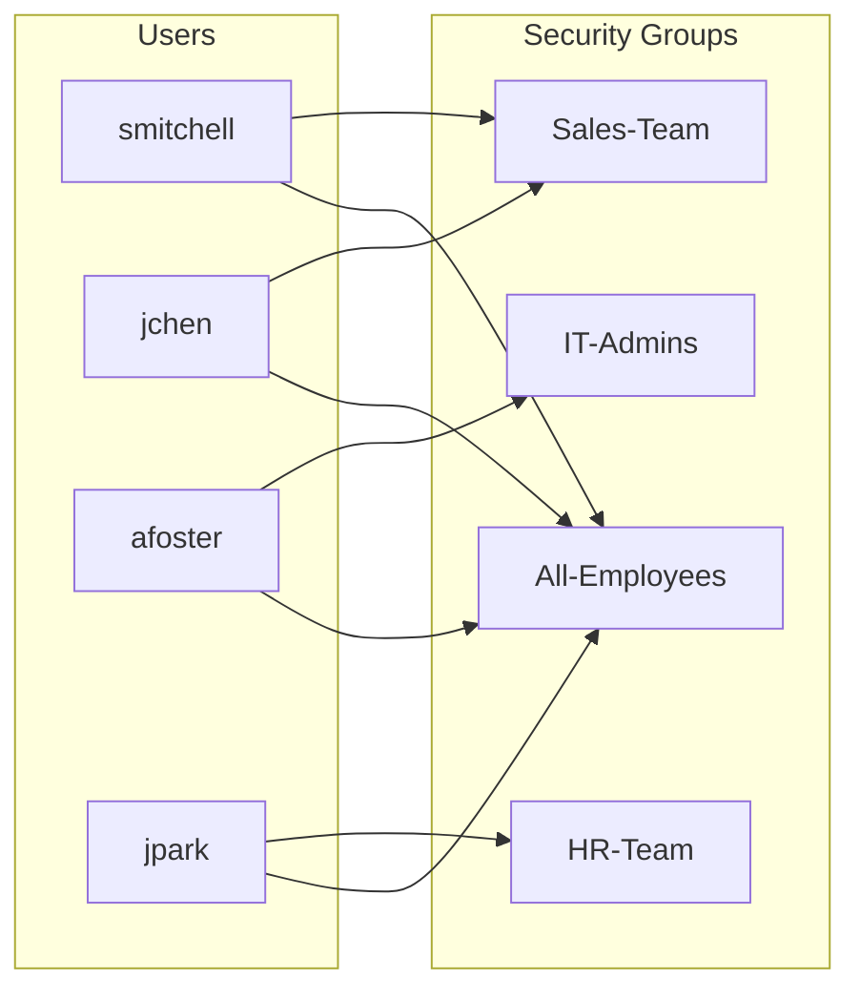

# 03 — Organizational Structure: OUs, Users, Groups

## Goal

Build a realistic AD organizational structure with Organizational Units 
representing functional boundaries, user accounts with proper metadata, 
and security groups for role-based access control.

## Organizational Unit Design

| OU | Purpose |
|-----|---------|
| Employees | All standard user accounts |
| IT | Reserved for IT-specific resources and service accounts |
| Servers | Server computer objects (member servers, application servers) |
| Workstations | Client computer objects (desktops, laptops) |
| Groups | All security and distribution groups |
| Domain Controllers | Built-in OU containing DC01 |

Separating Computers from Users is standard practice — it allows separate 
Group Policy linking strategies for different object types. The Groups OU 
keeps security groups out of the user OUs for cleaner administration.

## User Accounts Created

| Username | Display Name | Title | Department |
|----------|--------------|-------|------------|
| smitchell | Sarah Mitchell | Sales Manager | Sales |
| jchen | James Chen | Sales Rep | Sales |
| erodriguez | Emily Rodriguez | Engineer | Engineering |
| mthompson | Michael Thompson | Engineer | Engineering |
| jpark | Jessica Park | HR Manager | HR |
| dwilliams | David Williams | HR Specialist | HR |
| afoster | Amanda Foster | IT Support | IT |
| rpatel | Ryan Patel | IT Admin | IT |
| landerson | Lisa Anderson | Marketing Coordinator | Marketing |

Naming convention: first initial + last name, lowercase. UPN format: 
`<username>@corp.local`. Standard pattern used by most enterprises.

## Security Group Design



| Group | Members | Purpose |
|-------|---------|---------|
| Sales-Team | smitchell, jchen | Access to Sales department resources |
| Engineering-Team | erodriguez, mthompson | Access to Engineering resources |
| HR-Team | jpark, dwilliams | Access to HR-sensitive resources |
| IT-Admins | afoster, rpatel | Elevated access for IT personnel |
| All-Employees | All 8 standard employees | Company-wide announcements and shared resources |

All groups are Global / Security scope. This follows the AGDLP best 
practice (Accounts → Global → Domain Local → Permissions), though in this 
small lab the global groups are assigned directly to resources without 
nesting into domain local groups. The pattern is recognized and would scale 
to AGDLP with minor restructuring.

## Why Bulk Creation via PowerShell

The 8 base users were created via a PowerShell script (see 
`scripts/create-users.ps1`) for several reasons:

1. **Realism** — admins automate bulk operations, not click through ADUC 
   for each user
2. **Reproducibility** — the script can recreate the environment in 60 
   seconds if needed
3. **Metadata consistency** — title, department, UPN all set uniformly
4. **Demonstration value** — shows scripting capability beyond pure GUI work

A 9th user (Lisa Anderson) was created via the ADUC GUI to practice the 
manual workflow. Both methods are core IT support skills.

## Verification
```powershell

# Confirm OU structure
Get-ADOrganizationalUnit -Filter * | Select Name, DistinguishedName

# List all employees
Get-ADUser -Filter * -SearchBase "OU=Employees,DC=corp,DC=local" |
    Select Name, SamAccountName, Title, Department

# List groups and their members
Get-ADGroup -Filter * -SearchBase "OU=Groups,DC=corp,DC=local" | ForEach-Object {
    Write-Host "$($_.Name):" -ForegroundColor Yellow
    Get-ADGroupMember $_.Name | Select Name
}
```
