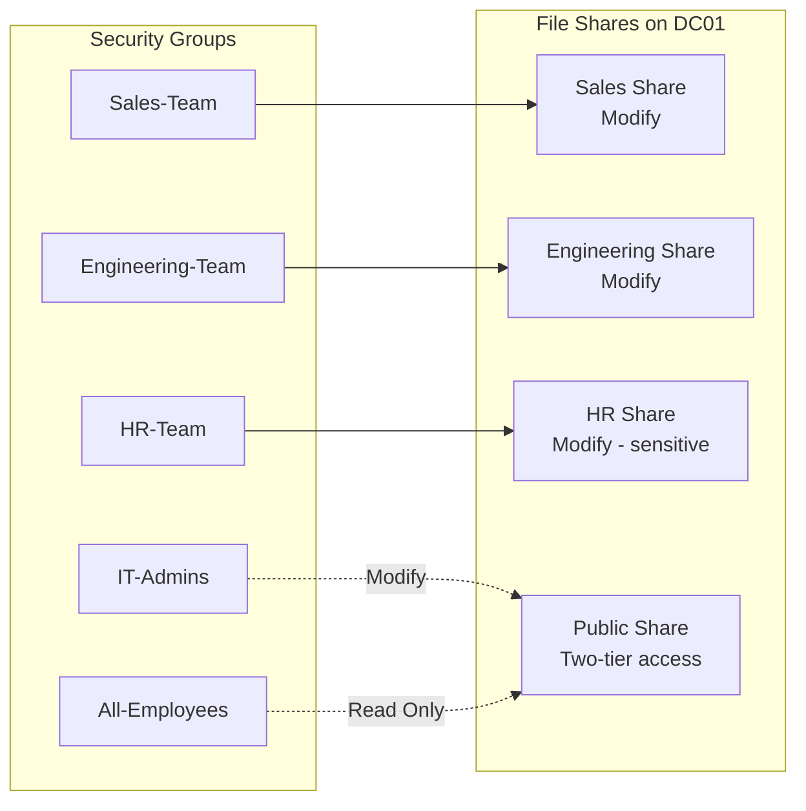

# 04 — File Services with Role-Based Access Control

## Goal

Deploy a file share structure on the domain controller that implements 
true role-based access control: each department has access only to their 
own data, with a company-wide read-only share for general announcements.

## Share Architecture



## Permission Layering

Each share has TWO layers of permissions, and the more restrictive applies:

1. **Share permissions** — set at the network level, controls SMB access
2. **NTFS permissions** — set on the filesystem, controls actual file access

Standard pattern used in this lab:
- **Share permission:** Full Control for the relevant group
- **NTFS permission:** Modify for the relevant group (or Read & Execute for 
  read-only resources)

This means NTFS does the real access control work, while share permissions 
act as a coarse filter. This is the production best practice — easier to 
manage permissions in one place (NTFS) than spread across two layers.

## Permission Matrix

| Share | Sales-Team | Engineering-Team | HR-Team | IT-Admins | All-Employees |
|-------|-----------|------------------|---------|-----------|---------------|
| \\DC01\Sales | Modify | None | None | None | None |
| \\DC01\Engineering | None | Modify | None | None | None |
| \\DC01\HR | None | None | Modify | None | None |
| \\DC01\Public | None | None | None | Modify | Read |

Note: SYSTEM and BUILTIN\\Administrators have Full Control on all shares 
(necessary for OS-level operations like backups and management).

## The Public Share Pattern

The Public share demonstrates a common real-world pattern: a "company 
announcements" or "shared resources" folder where:

- Everyone needs to **read** content (announcements, policies, forms)
- Only specific staff need to **write** content (IT, HR, or Communications)

This pattern is implemented through two security groups assigned to the 
same share with different permission levels.

## Inheritance Management

A critical lesson learned during build: Windows folders inherit permissions 
from their parent by default. If you accidentally apply permissions to a 
parent folder, all subfolders inherit them. This caused an early issue 
where Sales-Team accidentally received Modify on the parent `C:\Shares` 
folder, which propagated to all subfolders.

The fix:
1. Disable inheritance on the parent folder, clean it
2. Disable inheritance on each subfolder, set explicit permissions

See `scripts/audit-permissions.ps1` for a script that catches this kind 
of permission sprawl.

## Default Permissions to Remove

When configuring sensitive shares, two default Windows groups must be 
explicitly removed:

- **Authenticated Users** — includes literally every domain user
- **Users (BUILTIN\Users)** — includes Authenticated Users plus local 
  accounts

Failing to remove these on the HR share, for example, would mean any 
employee could read salary data. This is one of the most common 
permission-sprawl mistakes in real enterprises.

## Verification

```powershell
# List all custom shares
Get-SmbShare | Where-Object { $_.Path -like "C:\Shares\*" } | 
    Select Name, Path

# Show non-default NTFS permissions on each
"Sales","Engineering","HR","Public" | ForEach-Object {
    Write-Host "`n=== $_ ===" -ForegroundColor Yellow
    (Get-Acl "C:\Shares\$_").Access | Where-Object {
        $_.IdentityReference -notlike "NT AUTHORITY\SYSTEM" -and
        $_.IdentityReference -notlike "BUILTIN\Administrators" -and
        $_.IdentityReference -notlike "CREATOR OWNER"
    } | Select IdentityReference, FileSystemRights, IsInherited
}
```

Each share should show ONLY the appropriate department group with 
`IsInherited: False` — meaning permissions are explicit, not inherited 
from anywhere.
