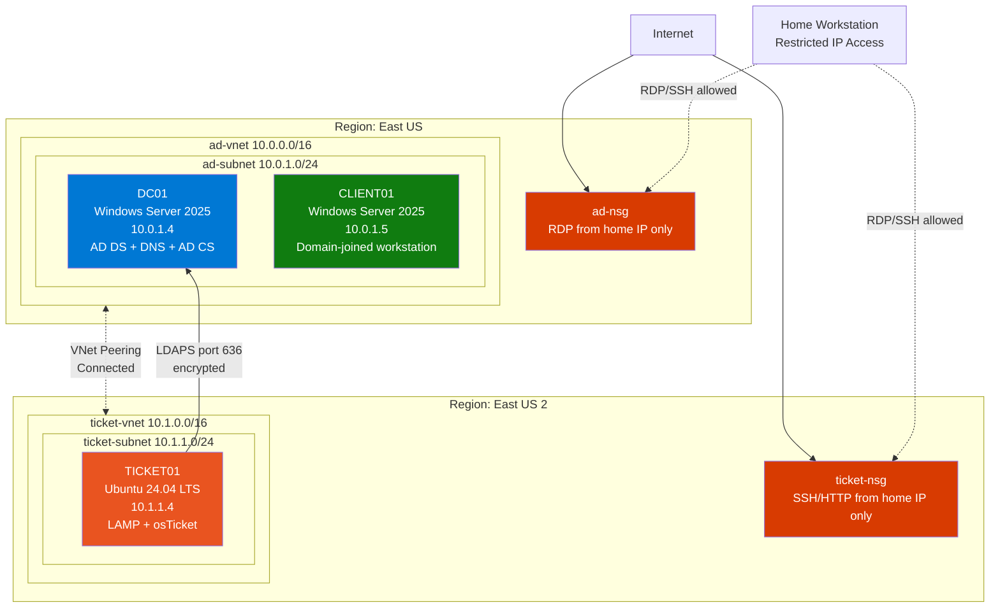

# Cross-Region AD Integration via LDAPS

Integration of the Ubuntu-based osTicket helpdesk (in East US 2) with the
Windows Active Directory domain (in East US) using encrypted LDAPS over a
peered virtual network. The goal: allow AD users to authenticate to
osTicket using their domain credentials, with no separate password store.

## Architecture



## Phase 1: VNet peering

Cross-region VNet peering connects the two virtual networks using Azure's
private backbone. Traffic between TICKET01 and DC01 stays within
Microsoft's network — never traversing the public internet.

### Configuration

Peering was created from the ad-vnet side, which automatically provisions
the reciprocal peering on ticket-vnet:

| Field | Value |
|---|---|
| Local peering link name (ad-vnet view) | `ad-to-ticket` |
| Remote peering link name (ticket-vnet view) | `ticket-to-ad` |
| Allow virtual network access (both sides) | Enabled |
| Allow forwarded traffic | Disabled (not needed for direct VM-to-VM) |
| Allow gateway transit | Disabled (no VPN gateway in this lab) |

### Verification

Both sides show **Connected** status in the Peerings blade of each VNet.
Network connectivity was validated from TICKET01 with:

```bash
ping -c 3 10.0.1.4         # ICMP to DC01
nc -zv 10.0.1.4 389         # TCP to LDAP port
```

## Phase 2: DNS configuration

### Azure VNet DNS

The ticket-vnet was configured with custom DNS pointing at DC01, so any
VM in the VNet automatically gets corp.local resolution via DHCP:

```
ticket-vnet → DNS servers → Custom
  10.0.1.4
```

VMs already running at the time of the change need to renew their DHCP
lease (a reboot is the simplest method).

### systemd-resolved configuration for the .local domain

By default, systemd-resolved on modern Linux distributions treats the
`.local` TLD as Multicast DNS (mDNS) per RFC 6762, refusing to forward
those queries to upstream DNS servers. Active Directory has used the
`.local` TLD since before that RFC existed, creating a well-known
conflict.

Symptom: `nslookup dc01.corp.local` returns SERVFAIL, but `dig @10.0.1.4
dc01.corp.local` succeeds. systemd-resolved is intercepting the query
locally instead of forwarding it.

Resolution: a drop-in configuration file disables mDNS/LLMNR and adds
corp.local as an explicit routing domain:

```ini
# /etc/systemd/resolved.conf.d/no-mdns.conf
[Resolve]
DNS=10.0.1.4
Domains=~corp.local
MulticastDNS=no
LLMNR=no
```

Applied with:

```bash
sudo systemctl restart systemd-resolved
sudo resolvectl flush-caches
```

This fix is portable to any Linux VM in the environment (Kali, RHEL,
other Ubuntu hosts) — drop the same file in place and restart the
resolver. Documented as a reusable component of the lab's "Linux client
joining AD" playbook.

### Verification

After the drop-in is applied:

```bash
nslookup corp.local                          # zone root → 10.0.1.4
nslookup -type=SRV _ldap._tcp.corp.local     # SRV record → dc01.corp.local
```

Both queries return correct results, including the SRV record that AD
service-aware clients use to locate domain controllers.

## Phase 3: Windows Firewall on DC01

DC01 runs Windows Firewall with default scopes that allow AD-related
ports from the local subnet only. With TICKET01 in a different VNet
(10.1.0.0/16) but reaching DC01 via peering, explicit allow rules are
needed:

```powershell
New-NetFirewallRule -DisplayName "Allow DNS UDP from ticket-vnet" `
  -Direction Inbound -Protocol UDP -LocalPort 53 `
  -RemoteAddress 10.1.0.0/16 -Action Allow

New-NetFirewallRule -DisplayName "Allow DNS TCP from ticket-vnet" `
  -Direction Inbound -Protocol TCP -LocalPort 53 `
  -RemoteAddress 10.1.0.0/16 -Action Allow

New-NetFirewallRule -DisplayName "Allow LDAP from ticket-vnet" `
  -Direction Inbound -Protocol TCP -LocalPort 389 `
  -RemoteAddress 10.1.0.0/16 -Action Allow

New-NetFirewallRule -DisplayName "Allow LDAPS from ticket-vnet" `
  -Direction Inbound -Protocol TCP -LocalPort 636 `
  -RemoteAddress 10.1.0.0/16 -Action Allow

New-NetFirewallRule -DisplayName "Allow Global Catalog from ticket-vnet" `
  -Direction Inbound -Protocol TCP -LocalPort 3268,3269 `
  -RemoteAddress 10.1.0.0/16 -Action Allow
```

The `-RemoteAddress 10.1.0.0/16` scope restricts these allowances to
traffic originating from the ticket-vnet only — random internet traffic
cannot reach these ports even though they're open on the host firewall.
This is the least-privilege equivalent of a production "trusted subnets"
configuration.

## Phase 4: LDAP signing relaxation

Windows Server 2022/2025 default Group Policy enforces LDAP signing on
domain controllers, rejecting any LDAP bind that isn't either:

- Encrypted via TLS (LDAPS on port 636), or
- Signed via SASL/Kerberos (typical for Windows clients)

Simple LDAP binds over plain port 389 are rejected with:

```
ldap_bind: Strong(er) authentication required (8)
additional info: 00002028: LdapErr: DSID-0C09035C, comment: The server requires 
binds to turn on integrity checking if SSL\TLS are not already active on the 
connection
```

For the lab, the GPO setting at:

> Default Domain Controllers Policy → Computer Configuration →
> Policies → Windows Settings → Security Settings → Local Policies →
> Security Options → "Domain controller: LDAP server signing
> requirements"

was changed from "Require signing" to "None", followed by:

```powershell
gpupdate /force
Restart-Service -Name "NTDS" -Force
```

Production-grade alternative: deploy AD Certificate Services (see Phase
5) and exclusively use LDAPS on port 636. This was ultimately the path
taken in this lab — the GPO change is documented here as a transitional
step in the troubleshooting sequence.

## Phase 5: AD Certificate Services

To enable LDAPS rather than relax signing requirements at the protocol
level, AD Certificate Services was installed on DC01 as an Enterprise
Root CA. Once installed, the CA auto-enrolls a Domain Controller
certificate that activates LDAPS on port 636.

### Installation

```powershell
Install-WindowsFeature -Name AD-Certificate -IncludeManagementTools

Install-AdcsCertificationAuthority `
  -CAType EnterpriseRootCA `
  -CACommonName "corp-DC01-CA" `
  -KeyLength 2048 `
  -HashAlgorithmName SHA256 `
  -ValidityPeriod Years `
  -ValidityPeriodUnits 5 `
  -Force
```

### Auto-enrollment

Auto-enrollment of the Domain Controller certificate was triggered
manually to avoid waiting for the periodic refresh:

```powershell
gpupdate /force
certutil -pulse
```

Verification that the cert was issued and is in DC01's local machine
store:

```powershell
Get-ChildItem Cert:\LocalMachine\My | 
  Where-Object { $_.Subject -like "*DC01*" } | 
  Format-Table Subject, NotAfter, Thumbprint
```

LDAPS availability confirmed by:

```powershell
Test-NetConnection -ComputerName localhost -Port 636
```

`TcpTestSucceeded : True` indicates LDAPS is bound to port 636 and
presenting a valid certificate.

## Phase 6: LDAPS bind verification from TICKET01

The CA cert is self-signed for the lab — TICKET01 doesn't trust it by
default. For testing, OpenLDAP's client was configured to skip cert
verification:

```bash
echo "TLS_REQCERT never" | sudo tee -a /etc/ldap/ldap.conf
```

For Apache/PHP specifically, the environment variable was set in
Apache's startup environment:

```bash
echo "export LDAPTLS_REQCERT=never" | sudo tee -a /etc/apache2/envvars
sudo systemctl restart apache2
```

A user-specific config was also added at the Apache home directory:

```bash
sudo tee /var/www/.ldaprc > /dev/null <<'EOF'
TLS_REQCERT never
EOF
sudo chown www-data:www-data /var/www/.ldaprc
```

### LDAPS bind test

```bash
LDAPTLS_REQCERT=never ldapsearch \
  -x -H ldaps://dc01.corp.local:636 \
  -D "labadmin@corp.local" -W \
  -b "DC=corp,DC=local" \
  -s base "(objectclass=*)" defaultNamingContext
```

Returns:

```
dn:
defaultNamingContext: DC=corp,DC=local
# search result
search: 2
result: 0 Success
```

This confirms the full LDAPS bind cycle works end-to-end:
- TICKET01 resolves dc01.corp.local via systemd-resolved
- TCP connection succeeds to port 636 across the VNet peering
- TLS handshake completes with the cert issued by corp-DC01-CA
- LDAP simple bind authenticates labadmin against AD
- Search request returns expected directory attributes

## Phase 7: osTicket LDAP plugin

The official osTicket Authentication and LDAP plugin (v0.6.2) was
installed via the standard plugin mechanism.

### Plugin file deployment

```bash
cd /tmp
wget https://s3.amazonaws.com/downloads.osticket.com/plugin/auth-ldap.phar
sudo mv auth-ldap.phar /var/www/osticket/include/plugins/
sudo chown www-data:www-data /var/www/osticket/include/plugins/auth-ldap.phar
sudo chmod 644 /var/www/osticket/include/plugins/auth-ldap.phar
```

### Plugin activation in osTicket

Via the admin panel: Admin Panel → Manage → Plugins → Add New Plugin →
Install the LDAP plugin.

### Plugin configuration

| Field | Value |
|---|---|
| Default Domain | corp.local |
| LDAP servers | `ldaps://dc01.corp.local:636` |
| Use TLS | Unchecked (using LDAPS protocol, not StartTLS) |
| Search User | labadmin@corp.local |
| Password | (labadmin AD password) |
| Search Base | DC=corp,DC=local |
| LDAP Schema | Automatically Detect |
| Staff Authentication | Enabled |
| Client Authentication | Enabled |

### Verification

User attributes were successfully retrieved from AD: when a user with
matching sAMAccountName attempts login at the end-user portal, the
plugin pulls their First Name, Last Name, and other attributes from
their AD user object and pre-populates the registration form.

## Known limitations

The auth-ldap plugin v0.6.2 has documented PHP 8.x compatibility issues
in the bundled Net_LDAP2 PEAR library. The destructor calls
`ldap_close()` on connection handles that PHP 8 may have already set to
`false`, raising:

```
TypeError: ldap_close(): Argument #1 ($ldap) must be of type LDAP\Connection, 
false given in phar:///var/www/osticket/include/plugins/auth-ldap.phar/include/
Net/LDAP2.php:701
```

This causes intermittent failures in the full authentication flow even
though directory queries succeed.

**Production migration path:** osTicket has an actively maintained
OAuth2 plugin that integrates with Microsoft Entra ID (Azure AD). For a
production deployment of osTicket in a Microsoft 365 environment, OAuth2
via Entra ID is the recommended path — it uses modern token-based
authentication, supports MFA natively, and avoids the PEAR Net_LDAP2
library entirely.

## Operational notes

- LDAPS cert renewal: AD CS auto-enrollment will renew the DC certificate
  before expiration. No manual action required for the 5-year CA validity
  window unless the CA itself is rotated.
- DNS forwarder behavior: TICKET01 caches DNS responses per
  systemd-resolved's default TTLs. After AD record changes, caches can
  be flushed with `sudo resolvectl flush-caches`.
- Plugin updates: monitor the osTicket GitHub for new auth-ldap releases
  that may address the PHP 8.x compatibility issue.

## Summary

End-to-end integration delivered:

1. Cross-region VNet peering (East US ↔ East US 2)
2. DNS resolution for corp.local from Linux clients (including SRV records)
3. Hardened Windows Firewall scoping AD traffic to specific subnets
4. AD Certificate Services issuing LDAPS certificates via auto-enrollment
5. Encrypted LDAPS bind from PHP-based application to AD
6. AD user attributes successfully retrieved by osTicket via LDAP search

Real-world skills demonstrated include enterprise networking patterns,
PKI deployment, identity federation, and methodical troubleshooting
across the Windows and Linux halves of a hybrid environment.
